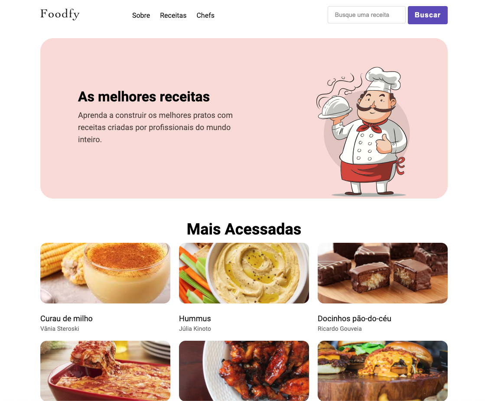

<h1 align="center">
<br>
  
<br>
<br>
FOODFY
</h1>

<p align="center">
This is a recipe web app in which the administrator of the website will give you access to add new chefs and recipes to it.
</p>

<p align="center">
  <a href="https://opensource.org/licenses/MIT">
    
  </a>
</p>

## Tech Stack

This app uses these main tools:

- **HTML**
- **CSS**
- **Node.js**
- **Express**
- **Postgres**

## Getting started

After cloning the repository, change the directory to the folder.
Ex:

```
cd launchbase-foodfy
```

Use the package manager [npm](https://https://www.npmjs.com/) to install all the needed dependencies.

```
npm install
```

If you do not have Postgres, you will need to install it and connect to your database server with a tool like Postbird.

Next step, you need to create the database by executing this SQL statement:

```
CREATE DATABASE launchbase_foodfy
```

Create a database user that will have full access to our database, change the password with a new one.

```
create user foodfyuser with encrypted password 'mypass';
grant all privileges on database launchbase_foodfy to foodfyuser;
```

Connect to Postbird using the **_foodfyuser_** username with its password and select the database **launchbase_foodfy**

Copy all the contents of the file **_arquivo.sql_** that is inside the **_sql_** folder of the project.

Then, select the created database on Postgres, paste the code in the Query tab and execute it.

Then, in the terminal run this command in the project folder to populate the database with sample data.

```
node seeds.js
```

Finally run this application with:

```
npm start
```

## License

This project is licensed under the MIT License - see the [LICENSE](https://opensource.org/licenses/MIT) page for details.
